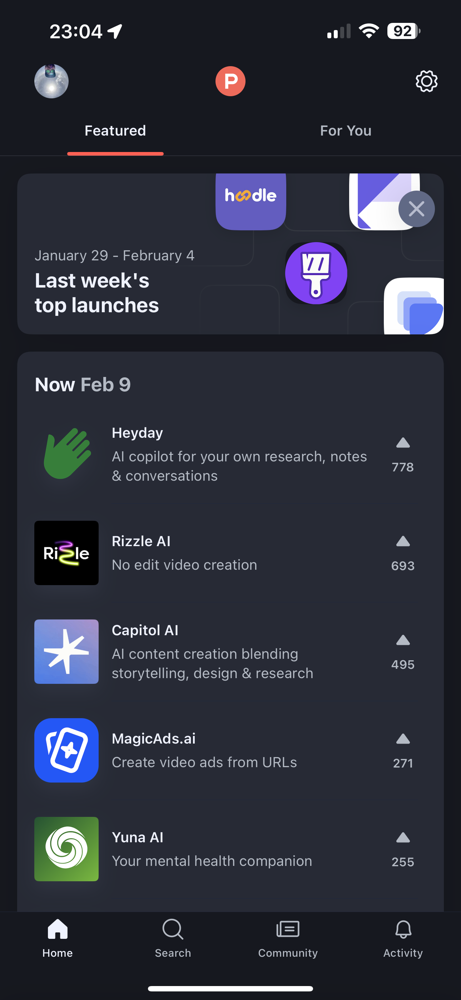
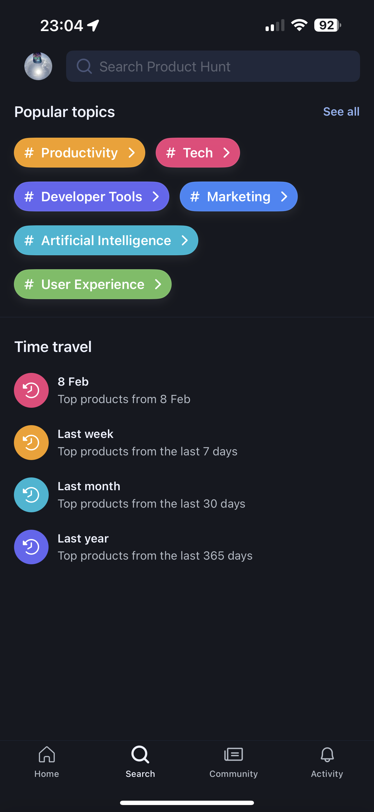
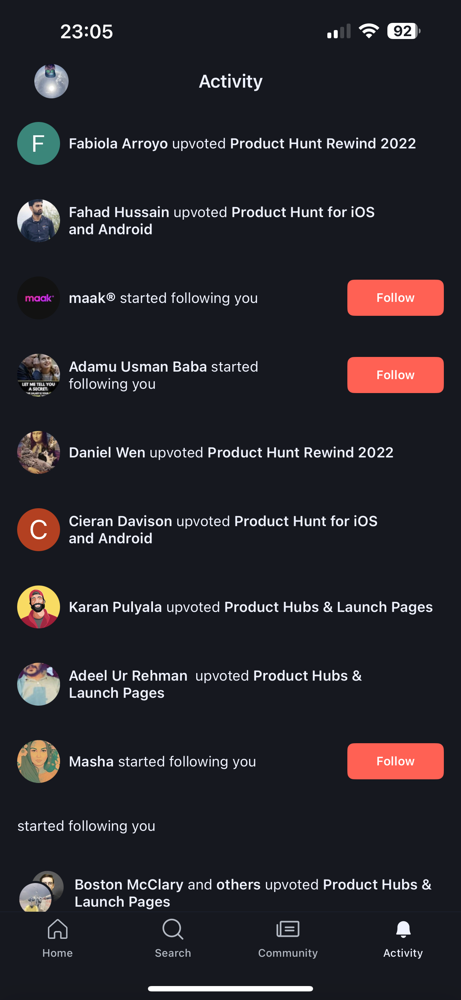
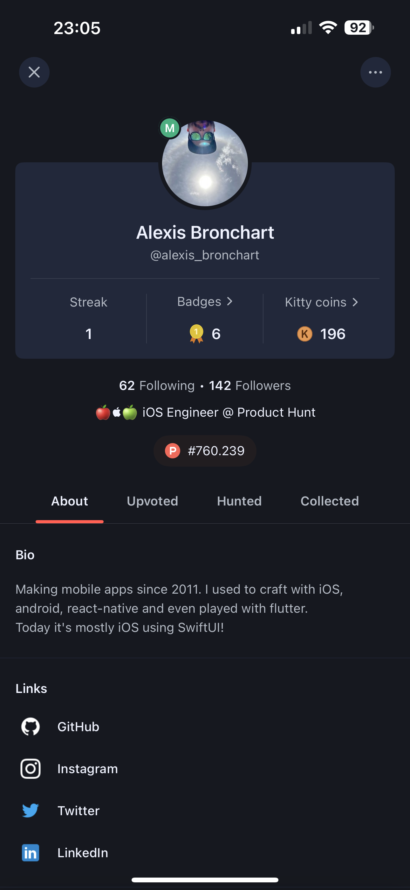
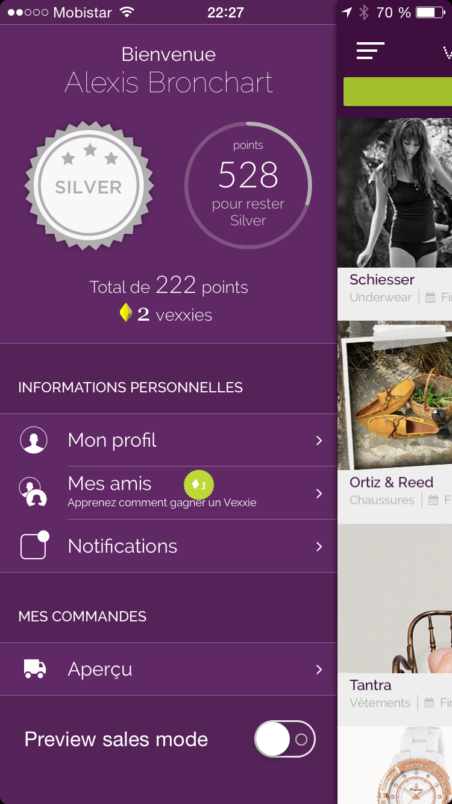
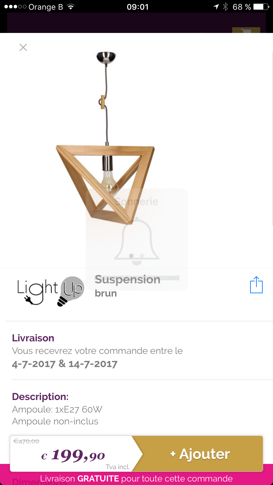
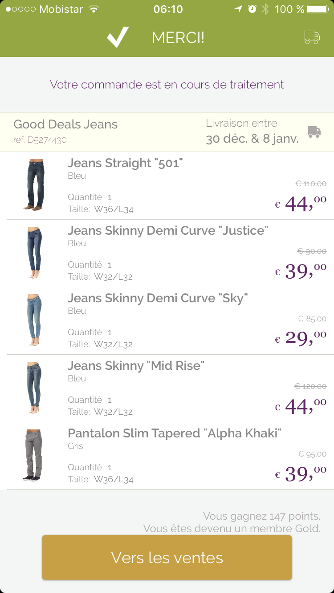

# [Alexis Bronchart - Senior iOS Engineer](https://www.linkedin.com/in/alexisbronchart/)

## [Nodalview](https://nodalview.com)

Nodalview is modernizing real estate industry with high-quality visuals, immersive content, and data insights for faster deal closures and precise buyer-home matches.

I joined the engineering team to help put the iOS app back on track. I initiated a re-write of the camera service for HDR photography, improved/added video editor features as well as coached other engineers / new hires.

##### 🔨Technologies: Swift & Objective-C, UIKit, SwiftUI, AVFoundation (photo & video), MVVM, VIP, Unit Tests, CI, REST API.

##### 🚀Platform: 📱iOS

App Store link: [Nodalview: real estate app](https://apps.apple.com/en/app/nodalview-real-estate-app/id1069345690)

## [Product Hunt](https://producthunt.com)

Product Hunt surfaces the best new products, every day. It's a place for product-loving enthusiasts to share and geek out about the latest mobile apps, websites, hardware projects, and tech creations.

I joined a brand new mobile team to support the renewed mobile strategy by developing a new generation iOS app from scratch (native iOS, pure SwiftUI, Apollo-GraphQL,backend in ruby). We started by re-creating all exisiting features from the previous app while adding foundations to support new features and growth (analytics, A/B testing, feature flags, deep-linking, notifications, ...).

##### 🔨Technologies: Swift & Objective-C, UIKit, SwiftUI, AVFoundation (photo & video), MVVM, VIP, Unit Tests, CI, REST API.

##### 🚀Platform: 📱iOS, iPadOS (macOS compatible)

App Store link: [Product Hunt](https://apps.apple.com/en-us/app/product-hunt/id904658671)

## [Elium](https://elium.com)

Elium’s mission is to help organisations make a difference by empowering their people with a knowledge-centric workplace.

I developed a brand new cross-platform mobile app, enabling all Elium customers to access their platform on mobile which in turn enabled Elium to sign new customers with mobile requirements. I was responsible for technical analysis, architecture, feature development, CI and releases.

##### 🔨Technologies: React Native, Relay, GraphQL, Swift, SwiftUI, Kotlin, Objective-C, Python (backend)

##### 🚀Platform: 📱iOS, iPadOS, Android

App Store link: [Elium for iOS](https://apps.apple.com/us/app/elium-knowledge-sharing/id1336484367)

Google Play Store link: [Elium for Android](https://play.google.com/store/apps/details?id=com.eliummobile&pli=1)

## Konecton club

Konecton apps aimed at connecting people who didn't know each other when physically attending an event (business event, conferences, parties, etc.). Konecton club (discontinued) was a white label version of the concept for night clubs that we implemented in several venues.

## [Site-Annonce](https://www.site-annonce.be)

I built the initial versions of iOS and Android apps (discontinued) for site-annonce.be, a searh engine for second hand products.

## Vente-Exclusive.com (acquired by [veepee](https://veepee.com))

Vente-Exclusive was the main belgian fashion & home e-commerce platform, now acquired by Veepee.

I took care of 3 generations of flash sales shopping iOS apps, either maintaining them or building them entirely. I also did some Android projects along the way.
Responsibilities: technical analysis, architecture, development, continuous integration, releases.

##### 🔨Technologies: Objective-C, Swift, UIKit, Core Data, Realm, Kotlin, Java, .NET

##### 🚀Platform: 📱iOS, iPadOS, Android

The original Vente-Exclusive iOS app has been replaced by the veepee one and is no longer available on the store.

